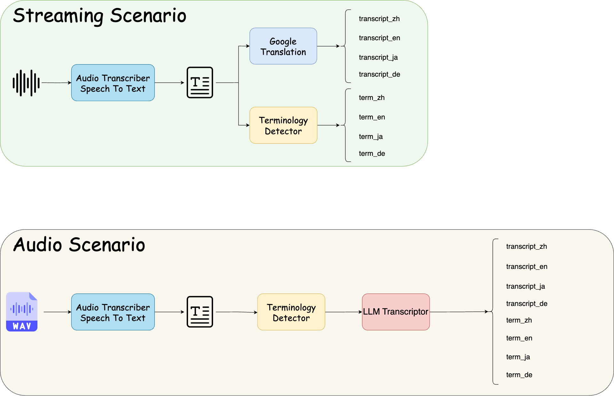

# 2025 TSMC IT CareerHack

**2nd place in the [2025 TSMC IT CareerHack](https://www.tsmc.com/static/english/careers/Careerhack/index.html)**

- 題目: 企業溝通無國界翻譯系統
- Team C2: [余振揚](https://github.com/LittleFish-Coder)、[莊上緣](https://github.com/shangyuan191)、[江宇浩](https://github.com/Hunk0724)、[林志芸](https://github.com/salmoniscute)

Our products(GGWhisPer) is a real-time translation system that can help enterprises to communicate with their foreign clients or partners. GGWhisPer can translate the spoken language into text and then translate it into the target language. It can also translate the text into the target language and then convert it into speech. GGWhisPer can help enterprises to communicate with their foreign clients or partners more effectively and efficiently.

## System Architecture
Check our [presentation](./presentation/C2_v1.pdf) for more details!

## Acknowledgement
| Name | Role |
| --- | --- |
| 余振揚 | AI Backend, Summarizer, ChatBot |
| 莊上緣 | Audio Transcriber, Text To Speech, Ablation Study |
| 江宇浩 | Terminology Detector, RAG Summarizer, RAG CharBot |
| 林志芸 | Web Frontend, Web Backend |